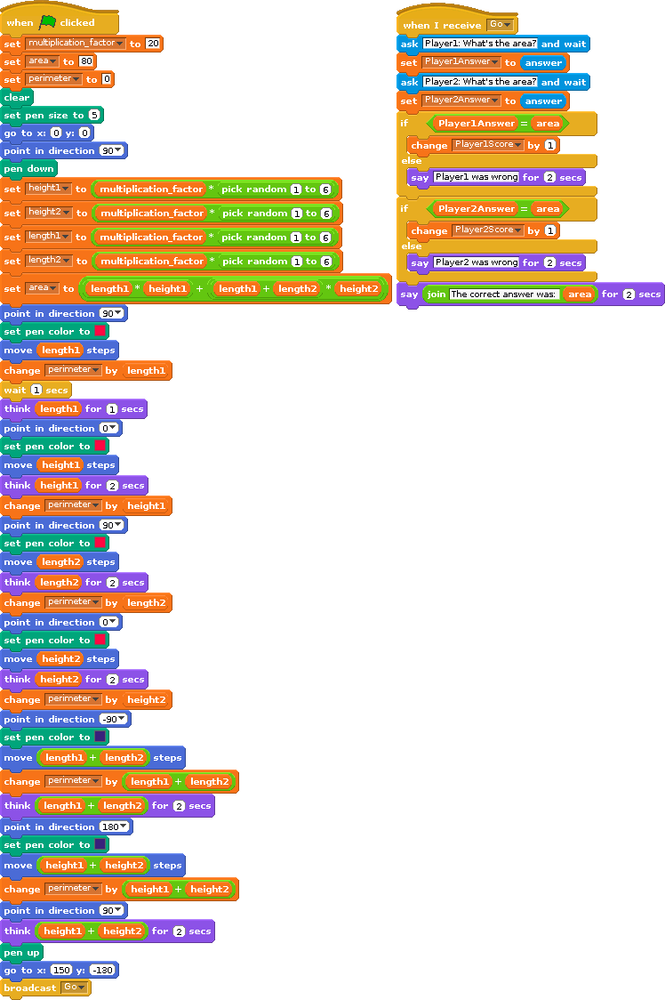

# 2 Player Game:  Rectilinear shapes

|Name                    |Class                          |
|:---|:---|
|______________   |____________________________________  |
|______________   |____________________________________  |

# Introduction

We are going to use Scratch to make a two player game to guess the Area of Rectilinear shapes. Scratch will pick some random numbers, will draw a shape of random height and lengths. Two players then guess the area given the length of the sides with scoring.

# Step 1: Random number generator

## Activity Checklist

+ Start a new project. ☐
+ Click on the **stage** next to the sprite and switch to the `Backgrounds` tab, and then click the `Choose Background from library` button and choose any background. Delete the original background. ☐
+ To make the game easier, we can have squares of 10 pixels by 10 pixels behind the shapes that are drawn. You can then add up the number of squares if you wish. If you want to do this, then select images/stage_grid.gif. Ask your teacher if you are unable to find this background. ☐
+ Create a variable called *roll* under Variables (Orange blocks) ☐
+ Create this script under Sprite1 (there is no need for any code to be on the Stage in this ipt): ☐

## Test your project

Click the green flag.

+ ☐
+ ______________

## Save your project

