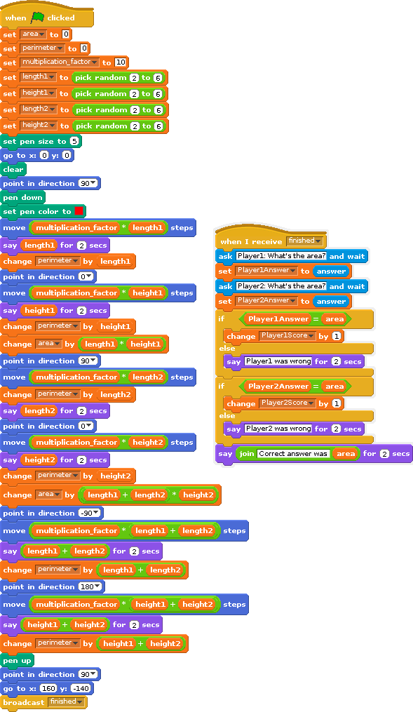

# 2 Player Game:  Rectilinear shapes

|Name                    |Class                          |
|:---|:---|
|______________   |____________________________________  |
|______________   |____________________________________  |

# Introduction

We are going to use Scratch to make a two player game to guess the Area of Rectilinear shapes. Scratch will pick some random numbers, will draw a shape of random height and lengths. Two players then guess the area given the length of the sides with scoring.

# Step 1: Pen commands

For this project, we will be drawing random shapes using the pen commands. Let's do a quick recap.

## Activity Checklist

+ Start a new project. ☐
+ Click on the **stage** next to the sprite and switch to the `Backgrounds` tab, and then click the `Choose Background from library` button and choose any background. Delete the original background. ☐
+ To make the game easier, we can have squares of 10 pixels by 10 pixels behind the shapes that are drawn. You can then add up the number of squares if you wish. If you want to do this, then select images/stage_grid.gif. Ask your teacher if you are unable to find this background. ☐
+ Click back on Sprite1. ☐
+ Create a variable called *roll* under Variables (Orange blocks) ☐
+ Import a new sprite using tractor.sprite.  ☐
+ Create this script under this sprite (there is no need for any code to be on the Stage in this program): ☐
+ You will need to add the outputs area and perimeter. These will be used for the outputs of the program. ☐

## Test your project

Click the green flag.

+ What does the tractor do? ☐
+ Can you change the colour of the pen ? ☐
+ What happens when you change the number of steps.  ☐
+ You should add a *clear* block under the when green flag clicked. This will ensure that the stages ends up clean before every run.  ☐

This is the foundation for all the code we will be building - point in direction *something*, set pen colour *some colour*, move *some length* and repeat.

## Save your project

# Step 2: 

Instead of the hardcoded length of 200, it would be great to be able make random shapes and sizes. We then are able to make a quiz.

## Activity Checklist
+ Add variables for all sprites: *length1*, *length2*, *height1* and *height2*. These determine the length of the sides in the rectilinear shapes. ☐
+ Add a variable multiplication_factor. This will be used to make the Sprite travel further across the screen than it would otherwise do. ☐

## Test your project

Click the green flag.

+ What does the tractor do? ☐
+ What does the multiplication_factor variable do? ☐
+ What happens when you change the random numbers for the variable *length1*.  ☐
+ You should add a *clear* block under the when green flag clicked. This will ensure that the stages ends up clean before every run.  ☐

## Save your project

# Step 3: 

Lets make the tractor make a few turns.

## Activity Checklist

We need to set the variable for  height1 at this point. height1 and length1 determine the area of the bottom left of the shape.

+ Make your code look similar to the following.

## Test your project

Click the green flag

+ Does the picture clear when the green flag is ticked?______________
+ Does the tractor make the shape as expected? ☐

## Save your project

# Step 4: Make the tractor complete most of the shape.

We need to make the tractor complete the right and top sides of the shape.

## Activity Checklist

We are going to need to use height2 and length2 which determine the size of the square area in the top right of the picture.
 

Sometimes when the random numbers get very large we lose the tractor off the edge of the screen. We could change the multiplication_factor making it smaller, but then we'd need to design a new grid. It's easier to make the random numbers slightly smaller for length and height.

+ Make your code look similar to the following:

+ We also need to be able to move the tractor back along the top side of the shape. This side of the shape is *length1 + length2* long. Check you are happy with why this is the case.
+ The code for this needs to be constructed carefully, so that the multiplication_factor multiplies the *sum of (length1 and length2)* and not just length1, then add length2. Using the green operators block and the orange variable block, make your code look like the following:

+ Put the resulting green block (multiplication_factor * (length1 + length2)) into the move(10) steps block.

## Test your project

Click the green flag

+ Does the tractor move back to a position vertically inline with where it started?

## Save your project

# Step 5:  Return the tractor horizontally and vertically

We need to get the tractor back to the starting point. To do this we need to travel horizontally length1+length2 and vertically height1+height2.

## Activity Checklist

+ Make your code look similar to the following:

## Test your project

Click the green flag

+ Does the tractor move back to the starting point?
+ Is it getting hard to see the shape it's made? That tractor is in the way. For the next piece of work, we need to get rid of it after it's finished marking out the perimeter.

## Save your project

# Step 6: The tractor obscures the view

## Activity Checklist

## Test your project

Click the green flag.

## Save your Project

# Step 7: Area calculation. 

In this exercise, the area of our shape is *length1* multiplied by *height1*, plus *length2* + *length1* multiplied by height2

## Activity checklist

## Test your project

Click the green flag.

## Save your Project

# Step 8: Perimeter calculation (just for fun).

# Step 9: 2 Player Quiz

##Activity Checklist

# Challenge: Creating the grid background (optional)

The grid background was created using Scratch. Here is the code used to create the horizontal lines. Can you extend it to add in the the vertical grid lines? 

## Activity Checklist

## Test your project

Click the green flag.

## Save your Project

