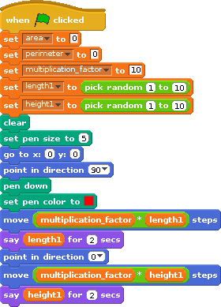
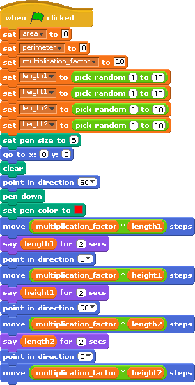

# 2 Player Game:  Rectilinear shapes

|Name                    |Class                          |
|:---|:---|
|______________   |____________________________________  |
|______________   |____________________________________  |

# Introduction

We are going to use Scratch to make a two player game to guess the Area of Rectilinear shapes. Scratch will pick some random numbers, will draw a shape of random height and lengths. Two players then guess the area given the length of the sides with scoring.

# Step 1: Pen commands

For this project, we will be drawing random shapes using the pen commands. Let's do a quick recap.

## Activity Checklist

+ Start a new project. ☐
+ Click on the **stage** next to the sprite and switch to the `Backgrounds` tab, and then click the `Choose Background from library` button and choose any background. Delete the original background. ☐
+ To make the game easier, we can have squares of 10 pixels by 10 pixels behind the shapes that are drawn. You can then add up the number of squares if you wish. If you want to do this, then select images/stage_grid.gif. Ask your teacher if you are unable to find this background. ☐
+ Click back on Sprite1. ☐
+ Create a variable called *roll* under Variables (Orange blocks) ☐
+ Import a new sprite using tractor.sprite.  ☐
+ Create this script under this sprite (there is no need for any code to be on the Stage in this program): ☐
+ You will need to add the outputs area and perimeter. These will be used for the outputs of the program. ☐

## Test your project

Click the green flag.

+ What does the tractor do? ☐
+ Can you change the colour of the pen ? ☐
+ What happens when you change the number of steps.  ☐
+ You should add a *clear* block under the when green flag clicked. This will ensure that the stages ends up clean before every run.  ☐

## Save your project

# Step 2: 

Instead of the hardcoded length of 200, it would be great to be able make random shapes and sizes. 

## Activity Checklist
+ Add variables for all sprites: *length1*, *length2*, *height1* and *height2*. These determine the length of the sides in the rectilinear shapes. ☐
+ Add a variable multiplication_factor. ☐

## Test your project

Click the green flag.

+ What does the tractor do? ☐
+ What does the multiplication_factor variable do? ☐
+ What happens when you change the number of steps.  ☐
+ You should add a *clear* block under the when green flag clicked. This will ensure that the stages ends up clean before every run.  ☐

# Step 3: 

Lets make the tractor make a few turns.

## Activity Checklist

## Save your project

# Step 4: Make the tractor complete the shape.

Make the tractor complete the right side of the shape

## Activity Checklist

Sometimes when the random numbers get very large we lose the tractor off the edge of the screen. We could change the multiplication_factor making it smaller, but then we'd need to design a new grid. It's easier to make the random numbers slightly smaller for length and height.

+ Make your code look similar to the following:

# Step 5:  Return the tractor horizontally and vertically

We need to get the tractor back to the starting point. To do this we need to travel horizontally length1+length2 and vertically height1+height2.

## Activity Checklist

The tractor needs to move 

Finally we need the tractor to complete the vertical movement.

# Step 6: The tractor obscures the view

## Activity Checklist

## Test your project

Click the green flag.

## Save your Project

# Step 7: Area calculation. 

In this exercise, the area of our shape is *length1* multiplied by *height1*, plus *length2* + *length1* multiplied by height2

## Activity checklist

## Test your project

Click the green flag.

## Save your Project

# Challenge: Creating the grid background (optional)

The grid background was created using Scratch. Here is the code used to create the horizontal lines. Can you extend it to add in the the vertical grid lines? 

## Activity Checklist

## Test your project

Click the green flag.

## Save your Project

